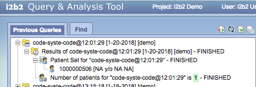

# i2FHIRb2 - FHIR in i2b2


[](https://pypi.python.org/pypi/i2FHIRb2)

[](https://pypi.python.org/pypi/i2FHIRb2)

## Edit history
* 0.2.0 - Major overhaul
* 0.2.1 - `Observation.referenceRange` temporarily removed to allow batch loads
* 0.2.2 - Added `conf_file` utility and removed hard-coded configuration files.  Now available via `pip`
* 0.2.3 - Partial refactoring and test cleanup

## Introduction
This package creates an i2b2 ontology from the FHIR STU3/R4 resource model.  It uses a combination of the [FHIR W5 (who, what, why, where, when) ontology](http://build.fhir.org/w5.ttl) and the [FHIR Resource Ontology](http://build.fhir.org/fhir.ttl) to create an i2b2 equivalent.

    
## I2B2 requirements
i2FHIRb2 has been tested with the postgres version of [i2b2 Software](https://www.i2b2.org/software/) release 1.7.08.  While it will theoretically
work with earlier versions, you may encounter issues, including:
1) The FHIR data includes UTF-8 characters.  Earlier releases of the i2b2 used `SQL_ASCII` encoding which won't work.
2) This package hasn't been tested with Oracle or Microsoft SQL Server.  We use [sqlalchemy](http://www.sqlalchemy.org/),
 which should minimize the issues, but you may want to talk with the authors before attempting to run with a 
 non-postgres back end.

Before you start, you will need to know:
1) The ip address and port number of the i2b2 SQL server.  The default for postgres is: **localhost:5432**
2) A userid/password combination that has write access to the `i2b2demodata` (CRC) and `i2b2metadata` schemas.  The default for postgresql is: **postgres**:[none], but, being a responsible dba, you will have changed these.

You should also have an i2b2 client (we use the web client) that can access and query the installed services.

## Installing i2FHIRb2
### Prerequsites 
You will need the latest version of [Python 3](https://www.python.org/) (3.6 or later).  This software will not work with Python 2 or earlier versions of Python 3.


```text
> python --version
Python 3.6.1
>

```

### Installation
#### Install i2FHIRb2 package
```text
> pip install i2FHIRb2
```

#### Validate the installation
```text
> generate_i2b2 -v
Version: 0.2.2              <--- a newer version may print here
```

#### Generate the configuration file
The following command creates a file, `my_conf` with the default configuration parameters for the i2FIRb2 package.
```text
> config_file -f my_conf --user <db user> --password <db password> 
```
This file has an editable set of parameters used by the FHIR loading tools.  All of these parameters can be set or overriden on the command line.  Of particular interest are:
* **dburl** - the URL of the target i2b2 SQL instance
* **user** - user id to use with instance
* **password** - password to use with instance
* **sourcesystem** - sourcesystem_id used in i2b2 tables.  Handy in that `removefacts` can remove all entries for a given source system
* **uploadid** - upload identifier used in i2b2 tables.  Individual uploads can also be removed.

#### Test the configuration file
```text
> generate_i2b2 --conf my_conf --test
Validating input files
	URL: http://build.fhir.org/fhir.ttl is valid
	URL: http://build.fhir.org/w5.ttl is valid
Validating sql connection
	Connection validated
Validating target tables
	Table concept_dimension exists
	Table encounter_mapping exists
	Table modifier_dimension exists
	Table observation_fact exists
	Table ontology_table exists
	Table patient_dimension exists
	Table patient_mapping exists
	Table provider_dimension exists
	Table table_access exists
	Table visit_dimension exists
Testing write access
	2 rows updated in table_access table
```
(TODO: Add a fail situation)

## Quick Summary
The sections below tell you how to:
1) [Load the FHIR Metadata Vocabulary as an i2b2 ontology](#loading-the-FHIR-metadata-vocabulary-into-i2b2)
2) [Load FHIR data as observation facts]()
3) [Run i2b2 queries across FHIR data]()

## Loading the FHIR Metadata Vocabulary into i2b2
There are two ways to load/update an existing set of i2b2 tables:
1) Run `generate_i2b2` and load the tables directly
2) Import the tab separated value (.tsv) tables that have been preloaded as part of this project
 
 Further instructions for running the various loader functions can be found in the [scripts](scripts) directory.
 
 
#### Loading the i2b2 ontology tables from the FHIR Metadata Vocabulary

```text
> generate_i2b2 --conf my_conf -l
Loading fhir.ttl
 (cached)
loading w5.ttl
 done

1 i2b2metadata.table_access record deleted
1 i2b2metadata.table_access record inserted
2143 i2b2demodata.concept_dimension records deleted
2143 i2b2demodata.concept_dimension records inserted
742 i2b2demodata.modifier_dimension records deleted
742 i2b2demodata.modifier_dimension records inserted
15222 i2b2metadata.custom_meta records deleted
19 i2b2metadata.custom_meta records deleted
15241 i2b2metadata.custom_meta records inserted
>
```

### Importing .tsv files

It is also possible to load the i2b2 ontology tables from the set of tab separated value (.tsv) that are included in the
distribution. 

**Note 1:** We do our best to reload these file with each release. Sometimes we don't remember.  Also, the .tsv files
in the distribution are derived from `../tests/data/fhir_metadata_vocabulary`, which may vary slightly from the FMV that
can be found at 'http://build.fhir.org/'.  You can regenerate these tables by:
```text
> generate_i2b2 --conf my_conf -od ../i2b2files
Loading fhir.ttl
 (cached)
loading w5.ttl
 done

writing i2b2files/table_access.tsv (1) records written
writing i2b2files/concept_dimension.tsv (2143) records written
writing i2b2files/modifier_dimension.tsv (742) records written
writing i2b2files/ontology_table.tsv (15241) records written
>
```

**Note 2:**: Before you load the files below, you may need to adjust the length of the following columns:
<table>
<tr>
<td><b>table</b></td>
<td><b>column</b></td>
<td><b>default size</b></td>
<td><b>new size</b></td>
</tr>
<tr>
<td>concept_dimension</td>
<td>concept_cd</td>
<td>50</td>
<td>200</td>
</tr>
<tr>
<td>modifier_dimension</td>
<td>modifier_cd</td>
<td>50</td>
<td>200</td>
</tr>
<tr>
<td>custom_meta</td>
<td>c_basecode</td>
<td>50</td>
<td>200</td>
</tr>
<tr>
<td></td>
<td>c_tooltip</td>
<td>900</td>
<td>1600</td>
</tr>
</table>

#### TSV Files
The pre-loaded tsv files can be found in the `i2b2files` subdirectory of the `i2FHIRb2` install:

* **`table_access.tsv`** -- the `table_access` table describes the location and root paths of i2b2 metadata.  This file has one row that states that FHIR resource definitions can be found in the `custom_meta` table with the root '\\FHIR\\'.
* **`concept_dimension.tsv`** --  the `concept_dimension` table links defines the set of possible concept codes that can appear in the `observation_fact` table.  For FHIR, this includes all "first level" resource entries -- Observation.identifier, Observation.basedOn, etc.
* **`modifier_dimension.tsv`** -- the `modifier_dimension` table contains possible modifier codes for the `observation_fact` table.  For FHIR, this contains the substructure represented in the concept codes -- `CodeableConcept.text`, `CodeableConcept.coding`, etc.
* **`ontology.tsv`** -- the "ontology" or "metadata" tables provide a navigational hierarchy that serve to organize and group i2b2 dimensions (`concept`, `modifier`, `patient`, `provider` and `visit`).  The **`i2FHIRb2`** project uses the FHIR W5 tables to provide high level organization and then lists the resources and their possible properties and modifiers for this table.

All of these tables have tab-separated values and the first row of each table has the column headers.   They can be imported directly into the corresponding i2b2 tables

**NOTE:** We have been unable to convince the postgreSQL import tool to treat empty columns as `NULL` values.  While, in general, the i2b2 software appears to treat NULLs and zero-length strings as equivalent, there is at least one place where this breaks -- the `m_exclusion_cd` column in the `custom_meta` (ontology) table. After loading the `ontology.tsv` table it is necessary to execute the following SQL:
 ```sql
 UPDATE custom_meta SET m_exclusion_cd = NULL WHERE m_exclusion_cd = '';
 ```


### Testing the installation
Open the i2b2 browser and navigate to the `FHIR Resources`.  As you drill down it should look like:


## Loading FHIR Resource Data
The `loadfacts` program is used to load select FHIR Resource instances in to the i2b2 CRC tables. It can load data from a list of files, a list of URLs or an input directory.  Input can either be in JSON or Turtle format. Both an `upload_id` and `sourcesystem_cd` can be specified
for tracking and management purposes.

### Example
```text
> loadfacts -v
FHIR i2b2 CRC loader -- Version 0.2.2
(venv) > loadfacts --conf my_conf -u 117 -l -t json -rm -i http://build.fhir.org/observation-example-f001-glucose.json
upload_id: 117
  Starting encounter number: 505749
  Starting patient number: 1000000507
--> loading http://build.fhir.org/observation-example-f001-glucose.json
89 triples
0: (Practitioner) - http://hl7.org/fhir/Practitioner/f005
1: (Patient) - http://hl7.org/fhir/Patient/f001
2: (Observation) - http://hl7.org/fhir/Observation/f001
---> Graph map phase complete
Generated:
    22 Observation facts
    1 Patients
    2 Patient mappings
=== SKIPS ===
    0 Bundled resources (shouldn't happen?)
    0 Visit resources
    0 Infrastructure resources
    0 Provider resources
    1 Unmapped resources

Deleted 0 patient_dimension records
Deleted 0 patient_mapping records
Deleted 0 observation_fact records
Deleted 0 visit_dimension records
Deleted 0 encounter_mapping records
0 / 0 patient_dimension records added / modified
0 / 0 patient_mapping records added / modified
1 / 0 visit_dimension records added / modified
1 / 1 encounter_mapping records added / modified
22 / 0 observation_fact records added / modified

>
```
The above example uses the following parameters:
* **`--conf my_conf`**  default configuration parameters
* **`-u 117`** upload identifier
* **`-l`** load the data tables
* **`-t json`** source format is JSON
* **`-rm`** Remove existing entries for this upload id before loading (Useful for testing)
* **`-i http://build.fhir.org/observation-example-f001-glucose.json` Input comes from this URL


The results of the above load can be (indirectly) viewed with a query such as the one below:


Note that `Selected groups occur in the same financial encounter` is selected in the "temporal constraint".  We are currently using the notion of "encounter" to represent "resource" -- the selection says that the code, the system and the interpretation all have to occur on the same encounter.

The results for this query (we selected the "Patient Set" and "Number of Patients" options) are shown below:



We can add patient demographics by following the link in the observation, loading:
```text
(venv) > loadfacts --conf my_conf -u 117 -l -t json -rm -i http://build.fhir.org/patient-example-f001-pieter.json
upload_id: 117
  Starting encounter number: 505750
  Starting patient number: 1000000506
--> loading http://build.fhir.org/patient-example-f001-pieter.json
136 triples
0: (Organization) - http://hl7.org/fhir/Organization/f001
1: (Patient) - http://hl7.org/fhir/Patient/f001
---> Graph map phase complete
Generated:
    0 Observation facts
    1 Patients
    2 Patient mappings
=== SKIPS ===
    0 Bundled resources (shouldn't happen?)
    0 Visit resources
    0 Infrastructure resources
    1 Provider resources
    0 Unmapped resources

Deleted 1 patient_dimension records
Deleted 2 patient_mapping records
Deleted 22 observation_fact records
Deleted 1 visit_dimension records
Deleted 2 encounter_mapping records
1 / 0 patient_dimension records added / modified
2 / 0 patient_mapping records added / modified
0 / 0 visit_dimension records added / modified
0 / 0 encounter_mapping records added / modified
0 / 0 observation_fact records added / modified
(venv) >
```


## Current State of the Project
At the moment, the FHIR structural model is represented pretty much verbatim in the i2b2 ontology and the corresponding resources instances in the i2b2 observation_fact table. We have demonstrated that it is possible to create queries in the i2b2 web client to access this information, but it should also be obvious that these queries would be unapproachable to anyone who wasn't both a FHIR and i2b2 model expert.

The next steps include:
### Mapping  [FHIR data types](http://www.hl7.org/FHIR/datatypes.html) to i2b2 equivalents.
Currently, FHIR data types are represented quite literally.  As an example [FHIR Quantity](http://www.hl7.org/FHIR/datatypes.html#quantity) currently has a separate row for `Quantity.unit`,
`Quantity.code`, `Quantity.comparator`, `Quantity.value` and `Quantity.system`.  There is a close correspondence between these and the observation_fact value columns `units_cd`, `tval_char`, and `nval_num` entries.  In addition, the `valueflag_cd` has a close correspondence to the [FHIR Observation interpretation](http://www.hl7.org/FHIR/observation-definitions.html#Observation.interpretation) field

### Representing FHIR coded concepts as i2b2 concept codes.
Currently, the [FHIR code](http://www.hl7.org/FHIR/datatypes.html#code), [FHIR Coding](http://www.hl7.org/FHIR/datatypes.html#Coding) and [FHIR CodeableConcept](http://www.hl7.org/FHIR/datatypes.html#CodeableConcept) data element values are represented as textual values.  We need to create i2b2 concept and/or modifier codes that represent this information.  This step would provide a key entry point to the use of FHIR terminologies in the i2b2 space.

### Adapt i2b2 value widgets to the FHIR use case

### Connect to FHIR terminologies and (possibly) terminology servers
 
### Representing FHIR resources as first class groupings.
Currently, we have preempted the "visit/financial encounter" dimension to represent FHIR resources.  We need to extend the i2b2 model to be able to group elements on the "Observation" or "Resource" level.
       
### Patient and Provide dimensions
The project currently assumes that all information appears in the `observation_fact` table.  This obviously isn't the case as:
* Patient / provider / visit information either maps to or extends the i2b2 dimension tables
* Resources such as 'Device', 'Medication', etc. currently have no place in i2b2 at all.
