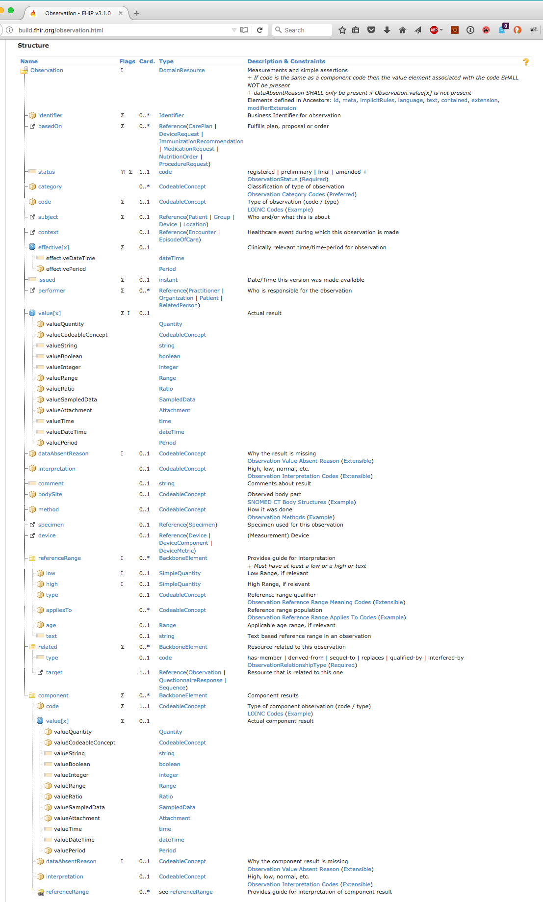
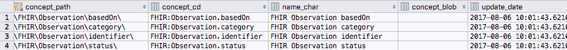

# generate_i2b2
`generate_i2b2` is a command line script that transforms the [FHIR Metadata
Vocabulary](http://build.fhir.org/fhir.ttl) and [FHIR W5 Ontology](http://build.fhir.org/w5.ttl)
into the i2b2 `concept_dimension`, `modifier_dimension` and `ontology` tables.


## Use
See [Setup Instructions](../setup.md) for installation instructions

```text
> python generate_i2b2 -h
usage: generate_i2b2 [-h] [-mv METAVOC URI] [-od TSV OUTPUT DIR]
                     [-t I2B2 TABLE] [-r RESOURCE]
                     [--sourcesystem SOURCESYSTEM_CD] [--base BASE] [-l] [-v]
                     [--list] [--test] [-db DBURL] [--user USER]
                     [--password PASSWORD] [--crcdb CRCDB] [--crcuser CRCUSER]
                     [--crcpassword CRCPASSWORD] [--ontdb ONTDB]
                     [--ontuser ONTUSER] [--ontpassword ONTPASSWORD]
                     [--onttable ONTOLOGY TABLE NAME]

FHIR in i2b2 metadata generator

optional arguments:
  -h, --help            show this help message and exit
  -mv METAVOC URI, --metavoc METAVOC URI
                        Input directory or URI of w5.ttl and fhir.ttl
                        files(default: http://build.fhir.org/)
  -od TSV OUTPUT DIR, --outdir TSV OUTPUT DIR
                        Output directory to store .tsv files. If absent, .tsv
                        files are not generated.
  -t I2B2 TABLE, --table I2B2 TABLE
                        Table to update (concept_dimension,
                        modifier_dimension, ontology_table, table_access)
                        (default: All tables)
  -r RESOURCE, --resource RESOURCE
                        Name of specific resource to emit (e.g. Observation).
                        (default: all)
  --sourcesystem SOURCESYSTEM_CD
                        sourcesystem code (default: "FHIR STU3")
  --base BASE           Concept dimension base path. (default: "\FHIR\")
  -l, --load            Load i2b2 SQL tables
  -v, --version         show program's version number and exit
  --list                List table names
  --test                Test the confguration
  -db DBURL, --dburl DBURL
                        Default database URL (default:
                        postgresql+psycopg2://localhost:5432/i2b2)
  --user USER           Default user name (default: postgres)
  --password PASSWORD   Default password (default: postgres)
  --crcdb CRCDB         CRC database URL. (default: dburl)
  --crcuser CRCUSER     User name for CRC database. (default: user)
  --crcpassword CRCPASSWORD
                        Password for CRC database. (default: password
  --ontdb ONTDB         Ontology database URL. (default: dburl)
  --ontuser ONTUSER     User name for ontology database. (default: user)
  --ontpassword ONTPASSWORD
                        Password for ontology database. (default: password)
  --onttable ONTOLOGY TABLE NAME
                        Ontology table name (default: custom_meta)
>
```

Note that some or all of the parameters can be recorded in a configuration file that is referenced with an '@[filename]' on the command line.  As an example, the [db_conf](db_conf) file in the [scripts](.\scripts) directory has the default setting for a MAC OSX PostgreSQL install.

### Generating loadable tab separated value (.tsv) files:
```text
> generate_i2b2 -o ../i2b2files
Loading fhir.ttl
loading w5.ttl
writing ../i2b2files/table_access.tsv (1) records written
Recursion on :http://hl7.org/fhir/DomainResource.extension.value.extension http://hl7.org/fhir/Extension
Recursion on :http://hl7.org/fhir/DomainResource.modifierExtension.value.extension http://hl7.org/fhir/Extension
Recursion on :http://hl7.org/fhir/Task.input.value.extension.value http://hl7.org/fhir/Element
Recursion on :http://hl7.org/fhir/Task.output.value.extension.value http://hl7.org/fhir/Element
writing ../i2b2files/concept_dimension.tsv (3380) records written
writing ../i2b2files/modifier_dimension.tsv (1875) records written
writing ../i2b2files/ontology.tsv (10185) records written
```

### Testing the i2b2 database configuration
You can test the configuration and accessibility of the i2b2, including write access by:
```text
> generate_i2b2 --test @db_conf
Validating input files
	URL: http://build.fhir.org/fhir.ttl is valid
	URL: http://build.fhir.org/w5.ttl is valid
Validating sql connection
	Connection validated
Validating target tables
	Table concept_dimension exists
	Table encounter_mapping exists
	Table modifier_dimension exists
	Table ontology_table exists
	Table patient_dimension exists
	Table patient_mapping exists
	Table provider_dimension exists
	Table table_access exists
	Table visit_dimension exists
>
```


### Loading i2b2 tables
```text
> cat db_conf 
--dburl postgresql+psycopg2://localhost:5432/i2b2
--user postgres
--password postgres
> generate_i2b2 http://build.fhir.org/ -l @db_conf
Loading fhir.ttl
loading w5.ttl
1 i2b2metadata.table_access record inserted
Changing length of concept_dimension.concept_cd from 50 to 200
1493 i2b2demodata.concept_dimension records inserted
Changing length of modifier_dimension.modifier_cd from 50 to 200
2392 i2b2demodata.modifier_dimension records inserted
Changing length of custom_meta.c_basecode from 50 to 200
Changing length of custom_meta.c_tooltip from 700 to 1600
10171 i2b2metadata.custom_meta records inserted
```

## Mapping
### `concept_dimension` Mapping
A `concept_dimension` `concept_cd` is created for:
1) Every FHIR predicate whose domain is a subClass of a FHIR Resource.
2) Every non-primitive path element between the base predicate and a primitive element.

### `modifier_dimension` Mapping
A `modifier_dimension` `modifier_cd` is created for every "terminal node" -  every predicate whose target is a FHIR primitive.  The only primitive predicates that are represented as concept codes are those domains are a FHIR Resource and whose ranges are primitive elements.

The images below describe how the mapping is performed.  We begin with the definition of the []Observation resource](http://build.fhir.org/observation.html) as it 
appears on the FHIR build server:




Some of the information in the above definition is also represented in the 
[FHIR Metadata Vocabulary](http://build.fhir.org/fhir.ttl) (FMV)
An excerpt of a small portion of the FMV is shown below.  (Note that some of the information that we don't use in this
project has been removed...)

The first element below shows the (partial) definitions of `fhir:DomainResource`, which is a subclass of `fhir:Resource`
and `fhir:Observation`, a direct subclass of `fhir:DomainResource` which means that it is also a subclass of `fhirResource`.
This means that we will generate i2b2 codes for all predicates whos domain is `fhir:Observation.`

```text
@prefix fhir:  <http://hl7.org/fhir/> .
@prefix owl:   <http://www.w3.org/2002/07/owl#> .
@prefix xsd:   <http://www.w3.org/2001/XMLSchema#> .
@prefix rdfs:  <http://www.w3.org/2000/01/rdf-schema#> . .
@prefix rdf:   <http://www.w3.org/1999/02/22-rdf-syntax-ns#> .
@prefix w5:    <http://hl7.org/fhir/w5#> .
@prefix dc:    <http://purl.org/dc/elements/1.1/> .

fhir:DomainResource  a   owl:Class ;
        rdfs:comment     "A resource that includes narrative, extensions, and contained resources." ;
        rdfs:label       "DomainResource" ;
        rdfs:subClassOf  fhir:Resource .

fhir:Observation  a      owl:Class ;
        rdfs:comment     "Measurements and simple assertions made about a patient, device or other subject." ;
        rdfs:label       "Observation" ;
        rdfs:subClassOf  fhir:DomainResource , w5:clinical.diagnostics .
```

A few of the predicates with the `fhir:Observation` domain are show below:


```text
fhir:Observation.identifier
        a                   owl:ObjectProperty ;
        rdfs:comment        "A unique identifier assigned to this observation." ;
        rdfs:domain         fhir:Observation ;                      <------ 
        rdfs:label          "Observation.identifier" ;
        rdfs:range          fhir:Identifier ;
        rdfs:subPropertyOf  w5:id ;
        dc:title            "Business Identifier for observation" .

fhir:Observation.basedOn
        a             owl:ObjectProperty ;
        rdfs:comment  "A plan, proposal or order that is fulfilled in whole or in part by this event." ;
        rdfs:domain   fhir:Observation ;                            <------ 
        rdfs:label    "Observation.basedOn" ;
        rdfs:range    fhir:Reference ;
        dc:title      "Fulfills plan, proposal or order" .

fhir:Observation.status
        a                   owl:ObjectProperty ;
        rdfs:comment        "The status of the result value." ;
        rdfs:domain         fhir:Observation ;                      <------ 
        rdfs:label          "Observation.status" ;
        rdfs:range          fhir:code ;
        rdfs:subPropertyOf  w5:status ;
        dc:title            "registered | preliminary | final | amended +" .

fhir:Observation.category
        a                   owl:ObjectProperty ;
        rdfs:comment        "A code that classifies the general type of observation being made." ;
        rdfs:domain         fhir:Observation ;                      <------ 
        rdfs:label          "Observation.category" ;
        rdfs:range          fhir:CodeableConcept ;
        rdfs:subPropertyOf  w5:class ;
        dc:title            "Classification of  type of observation" .
```

This is the equivalent `concept_dimension` representation


The range of Observation.status is `fhir:code`:

```text

fhir:Observation.status
        a                   owl:ObjectProperty ;
        rdfs:comment        "The status of the result value." ;
        rdfs:domain         fhir:Observation ;                       
        rdfs:label          "Observation.status" ;
        rdfs:range          fhir:code ;               <----------
        rdfs:subPropertyOf  w5:status ;
        dc:title            "registered | preliminary | final | amended +" .
```
which is a primitive type, meaning that there is exactly one code:
```text
fhir:code  a             owl:Class ;
        rdfs:comment     "A string which has at least one character and no leading or trailing ..." ;
        rdfs:label       "code" ;
        rdfs:subClassOf  fhir:Primitive .            <-----------
```

The range of `fhir:Observation.category` is `fhir:CodeableConcept':

```text
fhir:Observation.category
        a                   owl:ObjectProperty ;
        rdfs:comment        "A code that classifies the general type of observation being made." ;
        rdfs:domain         fhir:Observation ;                     
        rdfs:label          "Observation.category" ;
        rdfs:range          fhir:CodeableConcept ;                  <-------
        rdfs:subPropertyOf  w5:class ;
        dc:title            "Classification of  type of observation" .
```
`fhir:CodeableConcept` is not primitive:

```text

fhir:CodeableConcept  a  owl:Class ;
        rdfs:comment     "A concept that may be defined by a formal reference to ..." ;
        rdfs:label       "CodeableConcept" ;
        rdfs:subClassOf  fhir:Element .                         <--------
```
Which means we can determine all of the elements (predicates) whose domain is `fhir:CodeableConcept`:
```text
fhir:CodeableConcept.coding
        a             owl:ObjectProperty ;
        rdfs:comment  "A reference to a code defined by a terminology system." ;
        rdfs:domain   fhir:CodeableConcept ;                    <--------
        rdfs:label    "CodeableConcept.coding" ;
        rdfs:range    fhir:Coding ;
        dc:title      "Code defined by a terminology system" .
        
fhir:CodeableConcept.text
        a             owl:ObjectProperty ;
        rdfs:comment  "A human language representation of the concept as seen/selected/uttered ..." ;
        rdfs:domain   fhir:CodeableConcept ;                    <-----------
        rdfs:label    "CodeableConcept.text" ;
        rdfs:range    fhir:string ;
        dc:title      "Plain text representation of the concept" .
```
